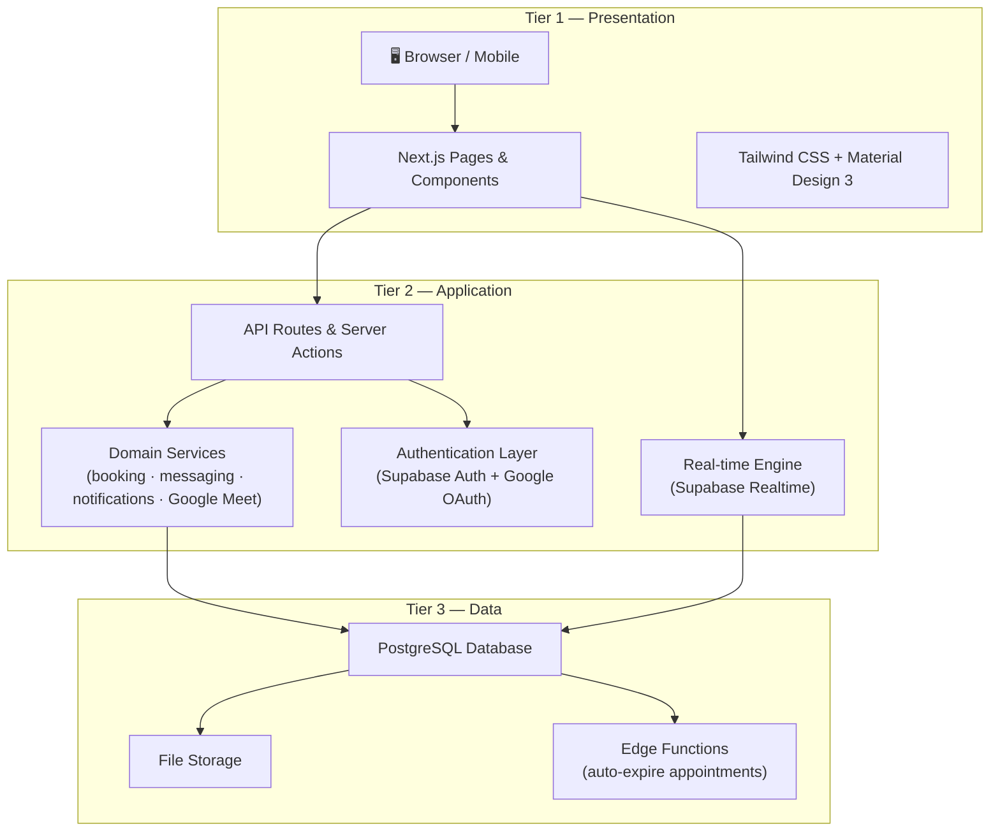

<p align="center"></p>

# GuidanceGo

> A secure, web-based counseling appointment scheduling and management platform developed for **Visayas State University (VSU)**. GuidanceGo connects students with counselors through an accessible, private, and efficient digital channel — appointment booking, real-time messaging, anonymous support, online Google Meet sessions, and counselor session notes.

**Current release:** `v1.0.0` (first public release)

GuidanceGo was developed under the internal codename **Inner Haven**. The pre-public milestone history (`IH.010.001`–`IH.010.008`) is preserved in the project's Internal Release History; from `v1.0.0` onward the project uses [Semantic Versioning](https://semver.org/).

---

## Overview

GuidanceGo replaces ad-hoc, walk-in-based counseling scheduling with a centralized online system. **Students** browse a counselor directory, view real-time availability, and book online or in-person appointments. **Counselors** manage their schedules, approve or decline requests, host Google Meet sessions, and keep private session notes.

The platform is designed around three goals:

- **Accessibility** — book and manage counseling from any device, with a guided onboarding flow.
- **Privacy** — strict role-based access, encrypted credential storage, and an anonymous support channel for students who prefer not to disclose their identity.
- **Efficiency** — real-time updates, tag-based cache invalidation, and a fast, responsive UI.

### Roles

- **Students** — book, reschedule, and cancel appointments; message counselors (identified or anonymous); view session notes; receive real-time notifications.
- **Counselors** — manage weekly availability; approve, decline, reschedule, complete, or cancel appointments; host Google Meet sessions; author session notes; respond to anonymous help requests.

---

## Key Features

The system implements seven core requirements (validated by a 72-case manual test suite):

1. **Appointment Management** — students book online or in-person appointments against live counselor availability; counselors approve, decline, reschedule, complete, or cancel. Double-booking and past-date booking are rejected at the database level.
2. **Notifications** — real-time, in-app notifications for booking events (request, approval, decline, reschedule, session notes) via a bell dropdown and a dedicated page; the unread badge updates live.
3. **Counselor Directory & Availability** — students browse counselor profiles and view availability up to 42 days ahead; counselors manage their own weekly schedule.
4. **Google Meet Integration** — counselors connect via Google OAuth 2.0; approving an online appointment automatically generates a Google Meet link. Expired connections prompt reconnection.
5. **Anonymous Help Requests** — students can start pseudonymous conversations with counselors; messages are private and each student–counselor pair is limited to one active thread.
6. **Authentication** — email/password and Google sign-in, email verification, password reset, and server-side route guards with role checks.
7. **Counselor Session Notes** — counselors author private session notes (general notes, recommendations, follow-up plans) per appointment; students are read-only and are notified when notes are first created.

**Supplementary features:** public landing page and supporting pages (About, Contact, Disclaimer, Privacy Policy, Terms of Service), Material Design 3 theming, skeleton loaders, dashboard server clock, counselor presence/heartbeat, and global cache warming.

---

## Technology Stack

| Layer | Technology |
|-------|------------|
| Framework / Runtime | Next.js 16 (App Router, React Server Components), React 19, TypeScript 5 |
| Backend / BaaS | Supabase — PostgreSQL 15, Auth, Realtime (WebSockets), Storage, Edge Functions |
| Styling | Tailwind CSS 3.4 with Material Design 3 design tokens |
| Authentication | Supabase Auth (email/password) + Google OAuth 2.0 |
| Google integrations | Google Meet, Google Calendar API, Google OAuth |
| Data layer | TanStack Query 5 (client caching) + Next.js tag-based cache invalidation (server) |
| Data architecture | Repository pattern with a service layer (contracts → repository → service) |
| Testing | Jest 30, ts-jest |
| Tooling | Node.js 20 LTS, npm, ESLint, Supabase CLI |

---

## System Architecture

GuidanceGo follows a **three-tier architecture**, separating concerns into the Presentation tier, Application tier, and Data tier. This keeps the codebase organized, secure, and easier to maintain.



### Tier 1 — Presentation (What users see and interact with)

The front-end is built with Next.js and React, styled with Tailwind CSS following Material Design 3 guidelines. Pages are organized by role — public visitors, authenticated users, students, and counselors each see a different set of pages tailored to their needs.

### Tier 2 — Application (Where business logic lives)

This is the heart of the system. When a student books an appointment, sends a message, or a counselor writes session notes, the logic runs here. Key pieces:

- **API Routes & Server Actions** handle incoming requests and check that the user is logged in and has the right permissions.
- **Domain Services** contain the core business rules — booking validation, notification delivery, anonymous messaging, and Google Meet link generation. Each domain (appointments, messaging, notifications, etc.) is self-contained.
- **Authentication** verifies identity through email/password or Google sign-in, and ensures only the right people can access sensitive data.
- **Real-time Engine** pushes live updates — new notifications, incoming messages, appointment changes — without needing to refresh the page.

### Tier 3 — Data (Where information is stored)

All data lives in a PostgreSQL database managed by Supabase. This includes user profiles, appointments, messages, notifications, and counselor notes. File attachments are stored separately in Supabase Storage. A scheduled Edge Function runs periodically to automatically mark past appointments as completed.


---

## Installation

**Prerequisites:** Node.js 20.x LTS, npm 10.x, Git 2.40+, Supabase CLI 2.x, and a Google Cloud Console account (for OAuth + Meet credentials).

```bash
# 1. Clone and install dependencies
git clone https://github.com/Kissu1/inner-haven-dev.git
cd inner-haven-dev
npm install

# 2. Configure environment variables
cp .env.example .env.local
#   Fill in: NEXT_PUBLIC_SUPABASE_URL, NEXT_PUBLIC_SUPABASE_PUBLISHABLE_KEY,
#            SUPABASE_SERVICE_ROLE_KEY, GOOGLE_CLIENT_ID, GOOGLE_CLIENT_SECRET,
#            GOOGLE_REDIRECT_URI, TOKEN_ENCRYPTION_KEY, NEXT_PUBLIC_APP_URL

# 3. Apply the database schema (migrations 0001–0011)
supabase db push

# 4. Start the dev server
npm run dev
#   → http://localhost:3000
```

**Google Cloud setup:** enable the Google Meet and Google Calendar APIs, create OAuth 2.0 credentials, and set the authorized redirect URI to `${NEXT_PUBLIC_APP_URL}/api/auth/google/callback`.

**Generate an encryption key** for Google token storage:

```bash
node -e "console.log(require('crypto').randomBytes(32).toString('hex'))"
```

**Available scripts:** `dev`, `build`, `start`, `lint`, `test`, `test:watch`.

---

## Production Deployment

1. **Environment** — set production values for all variables in `.env.example`; in particular point `NEXT_PUBLIC_APP_URL` at the production domain and provide `SUPABASE_SERVICE_ROLE_KEY` and a strong `TOKEN_ENCRYPTION_KEY`.
2. **Build & run** — `npm run build` then `npm start`, or deploy to any Node.js host (e.g. Vercel).
3. **Database** — run the migrations against the production Supabase project (`supabase db push`), then deploy and schedule the `auto-expire-appointments` Edge Function.
4. **Google Cloud** — add the production OAuth redirect URI (`https://<domain>/api/auth/google/callback`) to the authorized redirect URIs.
5. **Supabase Auth** — enable the email and Google providers and set the production site URL.
6. **Security headers** — CSP and other hardening headers are enforced via `next.config.ts`; confirm the Supabase and Google hosts are permitted in the `connect-src`/`img-src` directives.


---

## Testing

- **Automated suite** — Jest + ts-jest specs under [`test/`](./test) (8 spec files) cover all seven requirement areas: appointment scheduling, notifications, counselor directory/availability, Google Meet, anonymous help, authentication, and counselor notes. Run with `npm test`.
- **Manual test cases** — 72 scenario-based cases mapped to `REQ-001`–`REQ-007`, documented in [`test-suite/`](./test-suite/README.md).
- **Defects** — 5 bugs were logged by the independent software testing team during Q2 2026 and all were fixed and verified (100% fix rate), including one critical authorization gap (`BUG-005`, appointment details exposed via shared URL).

---

## Documentation

- [Manual Test Suite](./test-suite/README.md)
- **Design Specifications:** https://github.com/Piadopo-JK/inner-haven-docportal

---

## License

GuidanceGo is an academic software engineering capstone project developed at Visayas State University. © 2026 the GuidanceGo authors.

No open-source license has been applied to this repository; all rights are reserved by the authors. If you intend to reuse, fork, or adapt this codebase, contact the maintainers or add an appropriate `LICENSE` file before doing so.
